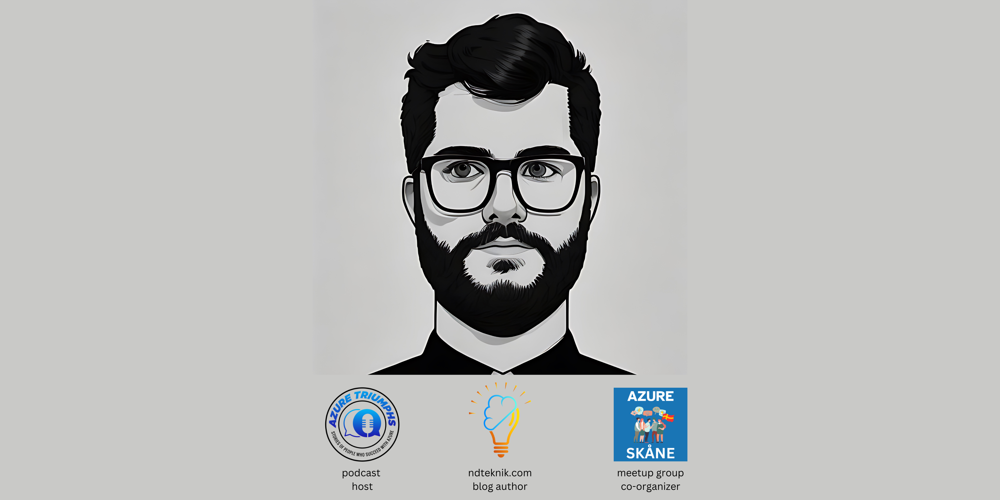

### Hey 👋

I'm Nikos, I live in Malmö, Sweden and I fix things; mostly within .NET and Azure.
- Check out my Blog: [https://ndteknik.com](https://ndteknik.com)
- Listen to my Podcast: [Azure Triumphs](https://open.spotify.com/show/5j97zeCSIqmzmrDKJOhgeE)
- Meet me in the meetup-group: [Azure Skåne](https://www.meetup.com/azure-skane/)

### Le work 🧑‍💼

- <i>Currently:</i> Senior Cloud & Software Engineer / <b>Freelancer</b>. 
- <i>Previously:</i> Senior Cloud Engineer & Azure Guild Lead @ <a href="capgemini.com">Capgemini</a>.
- <i>In between:</i> A few others, I loved them all.
- <i>Le start (2013):</i> Junior Software Developer @ <a href="pixlo.se">Mungo Digital</a>.

### Le education 🧑‍🎓

- <b>M.Sc.</b> in Software Engineering
- <b>B.Sc.</b> in IT & Communications

### Le tech stack 💻

- .NET, Azure
- if (isReadable && !frontend) then I'm in!

### Drop me a msg 📫

- <a href="https://www.linkedin.com/in/nikos-delis-83435232/">LinkedIn</a>
- <a href="https://twitter.com/ndteknik">X</a>
